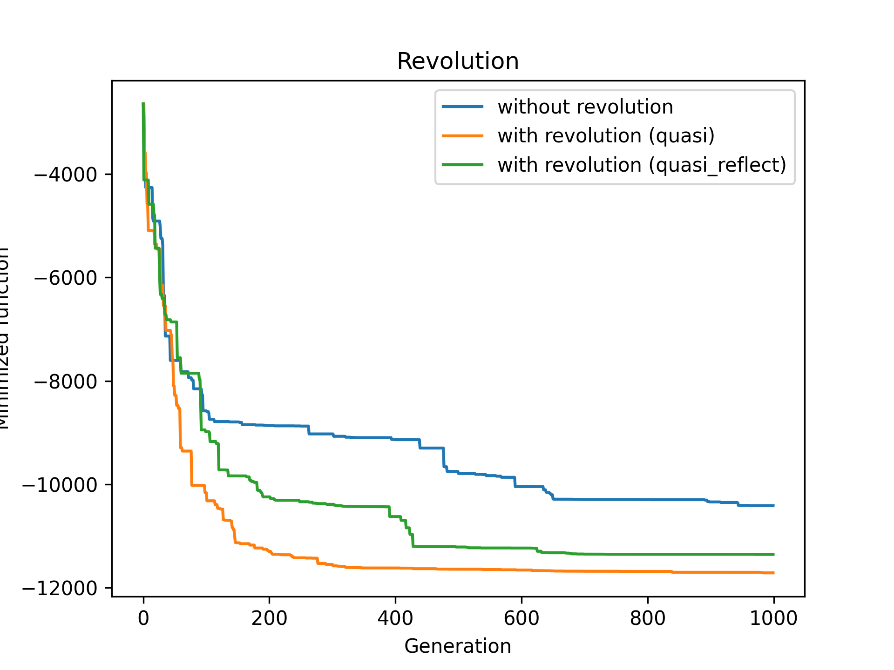
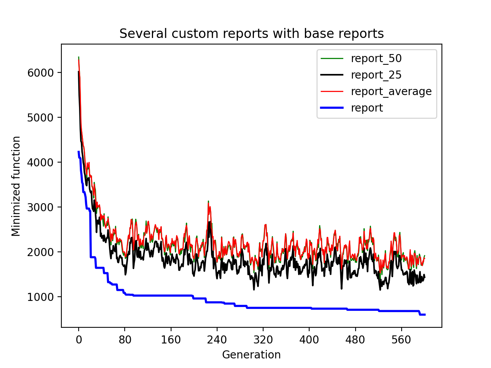

[](https://pypi.org/project/geneticalgorithm2/)
[](https://pepy.tech/project/geneticalgorithm2)
[](https://pepy.tech/project/geneticalgorithm2)
[](https://pepy.tech/project/geneticalgorithm2)

[](https://gitter.im/geneticalgorithm2/community?utm_source=badge&utm_medium=badge&utm_campaign=pr-badge)
[](https://github.com/PasaOpasen/geneticalgorithm2/issues) 
[](https://github.com/PasaOpasen/geneticalgorithm2/pulls)

**This is the supported advanced optimized fork of non-supported package** [geneticalgorithm](https://github.com/rmsolgi/geneticalgorithm) of *Ryan (Mohammad) Solgi*

- [About](#about)
- [Installation](#installation)
- [Updates information](#updates-information)
  - [**Future**](#future)
  - [6.7.3 speed up](#673-speed-up)
  - [6.7.2 little update](#672-little-update)
  - [6.7.1 patch](#671-patch)
  - [6.7.0 minor update (new features)](#670-minor-update-new-features)
  - [6.6.2 patch (speed up)](#662-patch-speed-up)
  - [6.6.1 patch](#661-patch)
  - [6.6.0 minor update (refactoring)](#660-minor-update-refactoring)
  - [6.5.1 patch](#651-patch)
  - [6.5.0 minor update (refactoring)](#650-minor-update-refactoring)
  - [6.4.1 patch (bug fix)](#641-patch-bug-fix)
  - [6.4.0 minor update (refactoring)](#640-minor-update-refactoring)
  - [6.3.0 minor update (refactoring)](#630-minor-update-refactoring)
- [Working process](#working-process)
  - [How to run](#how-to-run)
  - [Constructor parameters](#constructor-parameters)
  - [Genetic algorithm's parameters](#genetic-algorithms-parameters)
    - [AlgorithmParams object](#algorithmparams-object)
    - [Parameters of algorithm](#parameters-of-algorithm)
      - [**Count parameters**](#count-parameters)
      - [**Crossover**](#crossover)
      - [**Mutation**](#mutation)
      - [**Selection**](#selection)
  - [Methods and Properties of model:](#methods-and-properties-of-model)
- [Examples for begginer](#examples-for-begginer)
  - [A minimal example](#a-minimal-example)
  - [The simple example with integer variables](#the-simple-example-with-integer-variables)
  - [The simple example with Boolean variables](#the-simple-example-with-boolean-variables)
  - [The simple example with mixed variables](#the-simple-example-with-mixed-variables)
  - [Optimization problems with constraints](#optimization-problems-with-constraints)
  - [Middle example: select fixed count of objects from set](#middle-example-select-fixed-count-of-objects-from-set)
- [U should know these features](#u-should-know-these-features)
  - [Available crossovers](#available-crossovers)
  - [Function timeout](#function-timeout)
  - [Standard GA vs. Elitist GA](#standard-ga-vs-elitist-ga)
  - [Standard crossover vs. stud EA crossover](#standard-crossover-vs-stud-ea-crossover)
  - [Creating better start population](#creating-better-start-population)
    - [Select best N of kN](#select-best-n-of-kn)
    - [Do local optimization](#do-local-optimization)
    - [Optimization with oppositions](#optimization-with-oppositions)
  - [Revolutions](#revolutions)
  - [Duplicates removing](#duplicates-removing)
  - [Cache](#cache)
  - [Report checker](#report-checker)
  - [Middle callbacks](#middle-callbacks)
  - [How to compare efficiency of several versions of GA optimization](#how-to-compare-efficiency-of-several-versions-of-ga-optimization)
  - [Hints on how to adjust genetic algorithm's parameters (from `geneticalgorithm` package)](#hints-on-how-to-adjust-genetic-algorithms-parameters-from-geneticalgorithm-package)
- [Examples pretty collection](#examples-pretty-collection)
  - [Optimization test functions](#optimization-test-functions)
    - [Sphere](#sphere)
    - [Ackley](#ackley)
    - [AckleyTest](#ackleytest)
    - [Rosenbrock](#rosenbrock)
    - [Fletcher](#fletcher)
    - [Griewank](#griewank)
    - [Penalty2](#penalty2)
    - [Quartic](#quartic)
    - [Rastrigin](#rastrigin)
    - [SchwefelDouble](#schwefeldouble)
    - [SchwefelMax](#schwefelmax)
    - [SchwefelAbs](#schwefelabs)
    - [SchwefelSin](#schwefelsin)
    - [Stairs](#stairs)
    - [Abs](#abs)
    - [Michalewicz](#michalewicz)
    - [Scheffer](#scheffer)
    - [Eggholder](#eggholder)
    - [Weierstrass](#weierstrass)
  - [Using GA in reinforcement learning](#using-ga-in-reinforcement-learning)
  - [Using GA with image reconstruction by polygons](#using-ga-with-image-reconstruction-by-polygons)
- [Popular questions](#popular-questions)
  - [How to disable autoplot?](#how-to-disable-autoplot)
  - [How to plot population scores?](#how-to-plot-population-scores)
  - [How to specify evaluated function for all population?](#how-to-specify-evaluated-function-for-all-population)
  - [What about parallelism?](#what-about-parallelism)
  - [How to initialize start population? How to continue optimization with new run?](#how-to-initialize-start-population-how-to-continue-optimization-with-new-run)
# About

**geneticalgorithm2** is very flexible and highly optimized Python library for implementing classic
[genetic-algorithm](https://towardsdatascience.com/introduction-to-optimization-with-genetic-algorithm-2f5001d9964b) (GA).

Features of this package:

* written on pure python
* fast
* no hard dependences (only numpy primary)
* easy to use, easy to run
* easy to logging
* many plotting functions
* many cases of crossover, mutation and selection
* support of integer, boolean and real (continious/discrete) variables types
* support of mixed types of variables
* support of elitist and studEA genetic algorithm
* support of revolutions   
    
# Installation

```
pip install geneticalgorithm2
```

or 

```
pip3 install geneticalgorithm2
```

# Updates information

## **Future**

- duplicates removing and revolutions will be moved to `MiddleCallbacks` and removed as alone `run()` parameters
- `function_timeout` and `function` will be moved to `run()` method
- new stop criteria callbacks (min std, max functions evaluations)

## 6.7.3 speed up

- refactor to make `run()` method faster

## 6.7.2 little update

- better flexible logic for report, [take a look](#report-checker)
- removed `show mean` parameter from `model.plot_result` and now model reports only best score by default, not average and so on (u can specify if u wanna report average too)
- `plot_several_lines` useful function

## 6.7.1 patch

- changes according to new [OppOpPopInit](https://github.com/PasaOpasen/opp-op-pop-init) version

## 6.7.0 minor update (new features)

- add `mutation_discrete_type` and `mutation_discrete_probability` parameters in model. It controls mutation behavior for discrete (integer) variables and works like `mutation_type` and `mutation_probability` work for continuous (real) variables. Take a look at [algorithm parameters](#parameters-of-algorithm) 

## 6.6.2 patch (speed up)

- fix and speed up mutation

## 6.6.1 patch

- removed unnecessary dependences

## 6.6.0 minor update (refactoring)

- deprecated `variable_type_mixed`, now use `variable_type` for mixed optimization too
- deprecated `output_dict`, now it's better object with name `result`
- refactor of big part of **tests**
- refactor of README

## 6.5.1 patch

- replace `collections.Sequence` with `collections.abc.Sequence`, now it should work for `python3.10+`

## 6.5.0 minor update (refactoring)

- another form of data object using with middle callbacks (`MiddleCallbackData` dataclass instead of dictionary)
- type hints for callbacks module 

## 6.4.1 patch (bug fix)

- fix bug setting attribute to algorithm parameters (in middle callbacks) 


## 6.4.0 minor update (refactoring)

- new valid forms for `start_generation`; now it's valid to use
    * `None`
    * `str` path to saved generation
    * dictionary with structure `{'variables': variables/None, 'scores': scores/None}`
    * `Generation` object: `Generation(variables = variables, scores = scores)`
    * `np.ndarray` with shape `(samples, dim)` for only population or `(samples, dim+1)` for concatenated population and score (scores is the last matrix column)
    * `tuple(np.ndarray/None, np.ndarray/None)` for variables and scores
  
  here `variables` is 2D numpy array with shape `(samples, dim)`, `scores` is 1D numpy array with scores (function values) for each sample; [here](tests/output/start_gen.py) and [here](#how-to-initialize-start-population-how-to-continue-optimization-with-new-run) u can see examples of using these valid forms 


## 6.3.0 minor update (refactoring)

- type hints for entire part of functions
- new valid forms for function parameters (now u don't need to use numpy arrays everywhere)
- `AlgorithmParams` class for base GA algorithm parameters (instead of dictionary)
- `Generation` class for saving/loading/returning generation (instead of dictionary)

All that classes are collected [in file](geneticalgorithm2/classes.py). To maintain backward compatibility, `AlgorithmParams` and `Generation` classes have dictionary-like interface for getting fields: u can use `object.field` or `object['field']` notations.


# Working process

## How to run

Firstly, u should **import needed packages**. All available (but not always necessary) imports are:

```python
import numpy as np

from geneticalgorithm2 import geneticalgorithm2 as ga # for creating and running optimization model

from geneticalgorithm2 import Generation, AlgorithmParams, MiddleCallbackData # classes for comfortable parameters setting and getting

from geneticalgorithm2 import Crossover, Mutations, Selection # classes for specific mutation and crossover behavior

from geneticalgorithm2 import Population_initializer # for creating better start population

from geneticalgorithm2 import np_lru_cache # for cache function (if u want)

from geneticalgorithm2 import plot_pop_scores # for plotting population scores, if u want

from geneticalgorithm2 import Callbacks # simple callbacks (will be deprecated)

from geneticalgorithm2 import Actions, ActionConditions, MiddleCallbacks # middle callbacks
```

Next step: **define minimized function** like

```python
def function(X: np.ndarray) -> float: # X as 1d-numpy array
    return np.sum(X**2) + X.mean() + X.min() + X[0]*X[2] # some float result
```

If u want to find *maximum*, use this idea:

```python
f_tmp = lambda arr: -target(arr)

#
# ... find global min
#

tagret_result = -global_min
```

Okay, also u should **create the bounds for each variable** (if exist) like here:

```python
var_bound = np.array([[0,10]]*3) # 2D numpy array with shape (dim, 2)

# also u can use Sequence of Tuples (from version 6.3.0)
var_bound = [
    (0, 10),
    (0, 10),
    (0, 10)
]

```
U don't need to use variable boundaries only if variable type of each variable is boolean.

After that **create a `geneticalgorithm2` (was importing as ga) object**:

```python
# style before 6.3.0 version (but still works)
model = ga(function, dimension = 3, 
                variable_type='real', 
                 variable_boundaries = var_bound,
                 function_timeout = 10,
                 algorithm_parameters={'max_num_iteration': None,
                                       'population_size':100,
                                       'mutation_probability': 0.1,
                                       'mutation_discrete_probability': None,
                                       'elit_ratio': 0.01,
                                       'crossover_probability': 0.5,
                                       'parents_portion': 0.3,
                                       'crossover_type':'uniform',
                                       'mutation_type': 'uniform_by_center',
                                       'mutation_discrete_type': 'uniform_discrete',
                                       'selection_type': 'roulette',
                                       'max_iteration_without_improv':None}
            )

# from version 6.3.0 it is equal to

model = ga(function, dimension = 3, 
                variable_type='real', 
                 variable_boundaries = var_bound,
                 function_timeout = 10,
                 algorithm_parameters=AlgorithmParams(
                     max_num_iteration = None,
                     population_size = 100,
                     mutation_probability = 0.1,
                     mutation_discrete_probability = None,
                     elit_ratio = 0.01,
                     crossover_probability = 0.5,
                     parents_portion = 0.3,
                     crossover_type = 'uniform',
                     mutation_type = 'uniform_by_center',
                     mutation_discrete_type = 'uniform_discrete',
                     selection_type = 'roulette',
                     max_iteration_without_improv = None
                     )
            )

# or            
model = ga(function, dimension = 3, 
                variable_type='real', 
                 variable_boundaries = var_bound,
                 function_timeout = 10,
                 algorithm_parameters=AlgorithmParams()
            )           

```

**Run the search method**:

```python
# all of this parameters are default
result = model.run(
    no_plot = False, 
    disable_progress_bar = False,
    disable_printing = False,

    set_function = None, 
    apply_function_to_parents = False, 
    start_generation = None,
    studEA = False,
    mutation_indexes = None,

    init_creator = None,
    init_oppositors = None,
    duplicates_oppositor = None,
    remove_duplicates_generation_step = None,
    revolution_oppositor = None,
    revolution_after_stagnation_step = None,
    revolution_part = 0.3,
    
    population_initializer = Population_initializer(select_best_of = 1, local_optimization_step = 'never', local_optimizer = None),
    
    stop_when_reached = None,
    callbacks = [],
    middle_callbacks = [],
    time_limit_secs = None, 
    save_last_generation_as = None,
    seed = None
    )

# best solution
print(result.variable)

# best score
print(result.score)

# last population
print(result.last_population)

```

## Constructor parameters

* **function** (`Callable[[np.ndarray], float]`) - the given objective function to be minimized  
NOTE: This implementation minimizes the given objective function. (For maximization multiply function by a negative sign: the absolute value of the output would be the actual objective function)
        
* **dimension** (`int`) - the number of decision variables
        
* **variable_type** (`Union[str, Sequence[str]]`) - 'bool' if all variables are Boolean; 'int' if all variables are integer; and 'real' if all variables are real value or continuous. For mixed types use sequence of string of type for each variable
        
* **variable_boundaries** (`Optional[Union[np.ndarray, Sequence[Tuple[float, float]]]]`) - Default None; leave it None if variable_type is 'bool'; otherwise provide an sequence of tuples of length two as boundaries for each variable; the length of the array must be equal dimension. 
For example, `np.array([[0,100],[0,200]])` or `[(0, 100), (0, 200)]` determines lower boundary 0 and upper boundary 100 for first and upper boundary 200 for second variable where dimension is 2.
        
* **function_timeout** (`float`) - if the given function does not provide 
output before function_timeout (unit is seconds) the algorithm raise error.
For example, when there is an infinite loop in the given function. 
        
* **algorithm_parameters** (`Union[AlgorithmParams, Dict[str, Any]]`). Dictionary or AlgorithmParams object with fields:  
    * @ **max_num_iteration** (`int/None`) - stoping criteria of the genetic algorithm (GA)  
    * @ **population_size** (`int > 0`)   
    * @ **mutation_probability** (`float in [0,1]`)
    * @ **mutation_discrete_probability** (`float in [0,1]` or `None`)
    * @ **elit_ration** (`float in [0,1]`) - part of elit objects in population; if > 0, there always will be 1 elit object at least  
    * @ **crossover_probability** (`float in [0,1]`) 
    * @ **parents_portion** (`float in [0,1]`) - part of parents from previous population to save in next population (including `elit_ration`)  
    * @ **crossover_type** (`Union[str, Callable[[np.ndarray, np.ndarray], Tuple[np.ndarray, np.ndarray]]]`) - Default is `uniform`.
    * @ **mutation_type** (`Union[str, Callable[[float, float, float], float]]`) - Default is `uniform_by_center`
    * @ **mutation_discrete_type** (`Union[str, Callable[[int, int, int], int]]`) - Default is `uniform_discrete`
    * @ **selection_type** (`Union[str, Callable[[np.ndarray, int], np.ndarray]]`) - Default is `roulette`
    * @ **max_iteration_without_improv** (`int/None`) - maximum number of successive iterations without improvement. If `None` it is ineffective

## Genetic algorithm's parameters

### AlgorithmParams object

The parameters of GA is defined as a dictionary or `AlgorithmParams` object:

```python

algorithm_param = AlgorithmParams(
                max_num_iteration = None,
                population_size = 100,
                mutation_probability = 0.1,
                mutation_discrete_probability = None,
                elit_ratio = 0.01,
                crossover_probability = 0.5,
                parents_portion = 0.3,
                crossover_type = 'uniform',
                mutation_type = 'uniform_by_center',
                mutation_discrete_type = 'uniform_discrete',
                selection_type = 'roulette',
                max_iteration_without_improv = None
            )


# old style with dictionary
# sometimes it's easier to use this style
# especially if u need to set only few params
algorithm_param = {
                   'max_num_iteration': None,
                   'population_size':100,
                   'mutation_probability': 0.1,
                   'mutation_discrete_probability': None,
                   'elit_ratio': 0.01,
                   'crossover_probability': 0.5,
                   'parents_portion': 0.3,
                   'crossover_type':'uniform',
                   'mutation_type': 'uniform_by_center',
                   'mutation_discrete_type': 'uniform_discrete',
                   'selection_type': 'roulette',
                   'max_iteration_without_improv':None
                   }

```

To get actual default params use code:
```python
params = ga.default_params
```

To get actual parameters of existing model use code:
```python
params = model.param
```

An example of setting a new set of parameters for genetic algorithm and running `geneticalgorithm2` for our first simple example again:

```python
import numpy as np
from geneticalgorithm2 import geneticalgorithm2 as ga

def f(X):
    return np.sum(X)
    
    
varbound=[(0,10)]*3

algorithm_param = {'max_num_iteration': 3000,
                   'population_size':100,
                   'mutation_probability': 0.1,
                   'mutation_discrete_probability': None,
                   'elit_ratio': 0.01,
                   'crossover_probability': 0.5,
                   'parents_portion': 0.3,
                   'crossover_type':'uniform',
                   'mutation_type': 'uniform_by_center',
                   'mutation_discrete_type': 'uniform_discrete',
                   'selection_type': 'roulette',
                   'max_iteration_without_improv':None}

model=ga(function=f,
            dimension=3,
            variable_type='real',
            variable_boundaries=varbound,
            algorithm_parameters=algorithm_param
        )

model.run()
```
**Important**. U may use the small dictionary with only important parameters; other parameters will be default. It means the dictionary
```js
algorithm_param = {'max_num_iteration': 150,
                   'population_size':1000}
```
is equal to:
```js
algorithm_param = {'max_num_iteration': 150,
                   'population_size':1000,
                   'mutation_probability': 0.1,
                   'mutation_discrete_probability': None,
                   'elit_ratio': 0.01,
                   'crossover_probability': 0.5,
                   'parents_portion': 0.3,
                   'crossover_type':'uniform',
                   'mutation_type': 'uniform_by_center',
                   'mutation_discrete_type': 'uniform_discrete',
                   'selection_type': 'roulette',
                   'max_iteration_without_improv':None}
```

But it is better to use `AlgorithmParams` object instead of dictionaries.

### Parameters of algorithm

#### **Count parameters**

* **max_num_iteration**: The termination criterion of GA. 
If this parameter's value is `None` the algorithm sets maximum number of iterations automatically as a function of the dimension, boundaries, and population size. The user may enter any number of iterations that they want. It is highly recommended that the user themselves determines the **max_num_iterations** and not to use `None`. Notice that **max_num_iteration** has been changed to 3000 (it was already `None`). 

* **population_size**: determines the number of trial solutions in each iteration.

* **elit_ration**: determines the number of elites in the population. The default value is 0.01 (i.e. 1 percent). For example when population size is 100 and **elit_ratio** is 0.01 then there is one elite unit in the population. If this parameter is set to be zero then `geneticalgorithm2` implements a standard genetic algorithm instead of elitist GA. [See example](#standard-ga-vs-elitist-ga) of difference

* **parents_portion**: the portion of population filled by the members of the previous generation (aka parents); default is 0.3 (i.e. 30 percent of population)

* **max_iteration_without_improv**: if the algorithms does not improve the objective function over the number of successive iterations determined by this parameter, then GA stops and report the best found solution before the `max_num_iterations` to be met. The default value is `None`. 

#### **Crossover**

* **crossover_probability**: determines the chance of an existed solution to pass its genome (aka characteristics) to new trial solutions (aka offspring); the default value is 0.5 (i.e. 50 percent)

* **crossover_type**: there are several options including `'one_point'`, `'two_point'`, `'uniform'`, `'segment'`, `'shuffle'` crossover functions; default is `'uniform'` crossover. U also can use crossover as functions from `Crossover` class:
    * `Crossover.one_point()`
    * `Crossover.two_point()`
    * `Crossover.uniform()`
    * `Crossover.uniform_window(window = 7)`
    * `Crossover.shuffle()`
    * `Crossover.segment()`
    * `Crossover.mixed(alpha = 0.5)` -- only for real variables
    * `Crossover.arithmetic()` -- only for real variables
    
    Have a look at [crossovers' logic](#available-crossovers)

    If u want, write your own crossover function using simple syntax:
    ```python
    def my_crossover(parent_a: np.ndarray, parent_b: np.ndarray):
        # some code
        return child_1, child_2
    ```

#### **Mutation**

* **mutation_probability**: determines the chance of each gene in each individual solution to be replaced by a random value. Works for continious variables or for all variables if **mutation_discrete_probability** is `None`

* **mutation_discrete_probability**: works like **mutation_probability** but for discrete variables. If `None`, will be changed to **mutation_probability** value; so just don't specify this parameter if u don't need special mutation behaviour for discrete variables

* **mutation_type**: there are several options (only for real variables) including `'uniform_by_x'`, `'uniform_by_center'`, `'gauss_by_x'`, `'gauss_by_center'`; default is `'uniform_by_center'`. U also can use mutation as functions from `Mutations` class:
    * `Mutations.gauss_by_center(sd = 0.2)`
    * `Mutations.gauss_by_x(sd = 0.1)`
    * `Mutations.uniform_by_center()`
    * `Mutations.uniform_by_x()`

    (If u want) write your mutation function using syntax:
    ```python
    def my_mutation(current_value: float, left_border: float, right_border: float) -> float:
        # some code
        return new_value 
    ```

* **mutation_discrete_type**: now there is only one option for discrete variables mutation: `uniform_discrete` (`Mutations.uniform_discrete()`) which works like `uniform_by_center` real mutation but with integer numbers. Anyway, this option was included at version 6.7.0 to support custom discrete mutations if u need it. For using custom mutation just set this parameter to function like
  ```python
    def my_mutation(current_value: int, left_border: int, right_border: int) -> int:
        # some code
        return new_value 
  ```

#### **Selection**

* **selection_type**: there are several options (only for real) including `'fully_random'` (just for fun), `'roulette'`, `'stochastic'`, `'sigma_scaling'`, `'ranking'`, `'linear_ranking'`, `'tournament'`; default is `roulette`. U also can use selection as functions from `Selection` class:
    * `Selection.fully_random()`
    * `Selection.roulette()`
    * `Selection.stochastic()`
    * `Selection.sigma_scaling(epsilon = 0.05)`
    * `Selection.ranking()`
    * `Selection.linear_ranking(selection_pressure = 1.5)`
    * `Selection.tournament(tau = 2)`

    If u want, write your selection function using syntax:
    ```python
    def my_mutation(sorted_scores: np.ndarray, parents_count: int):
        # some code
        return array_of_parents_indexes 
    ```


## Methods and Properties of model:

The main method if **run()**. It has parameters:

* **no_plot** (`bool`) - do not plot results using matplotlib by default

* **disable_progress_bar** (`bool`) - do not show progress bar (also it can be faster by 10-20 seconds)

* **disable_printing** (`bool`) - don't print any text (except progress bar)

* **set_function** (`Optional[Callable[[np.ndarray], np.ndarray]]`): 2D-array -> 1D-array function, which applies to matrix of population (size (samples, dimension)) to estimate their values ("scores" in some sense)
        
* **apply_function_to_parents** (`bool`) - apply function to parents from previous generation (if it's needed), it can be needed at working with games agents, but for other tasks will just waste time

* **start_generation** (`Union[str, Dict[str, np.ndarray], Generation, np.ndarray, Tuple[Optional[np.ndarray], Optional[np.ndarray]]]`) -- one of cases ([take a look](#how-to-initialize-start-population-how-to-continue-optimization-with-new-run)):
  *  `Generation` object
  *  dictionary with structure `{'variables':2D-array of samples, 'scores': function values on samples}` (if `'scores'` value is `None` the scores will be compute)
  *  path to `.npz` file (`str`) with saved generation  
  *  `np.ndarray` (with shape `(samples, dim)` or `(samples, dim+1)`) 
  *  tuple of `np.ndarray`s / `None`. 

* **studEA** (`bool`) - using stud EA strategy (crossover with best object always). Default is false. [Take a look](#standard-crossover-vs-stud-ea-crossover)
* **mutation_indexes** (`Optional[Union[Sequence[int], Set[int]]]`) - indexes of dimensions where mutation can be performed (all dimensions by default). [Example](tests/mut_indexes.py)

* **init_creator**: (`Optional[Callable[[], np.ndarray]]`), the function creates population samples. By default -- random uniform for real variables and random uniform for int. [Example](#optimization-with-oppositions)
* **init_oppositors**: (`Optional[Sequence[Callable[[np.ndarray], np.ndarray]]]`) -- the list of oppositors creates oppositions for base population. No by default. [Example](#optimization-with-oppositions)
* **duplicates_oppositor**: `Optional[Callable[[np.ndarray], np.ndarray]]`, oppositor for applying after duplicates removing. By default -- using just random initializer from creator. [Example](#duplicates-removing)
* **remove_duplicates_generation_step**: `None/int`, step for removing duplicates (have a sense with discrete tasks). No by default. [Example](#duplicates-removing)
* **revolution_oppositor** = `Optional[Callable[[np.ndarray], np.ndarray]]`, oppositor for revolution time. No by default. [Example](#revolutions)
* **revolution_after_stagnation_step** = `None/int`, create revolution after this generations of stagnation. No by default. [Example](#revolutions)
* **revolution_part** (`float`): the part of generation to being oppose. By default is 0.3. [Example](#revolutions)

* **population_initializer** (`Tuple[int, Callable[[np.ndarray, np.ndarray], Tuple[np.ndarray, np.ndarray]]]`) -- object for actions at population initialization step to create better start population. [Take a look](#creating-better-start-population)

* **stop_when_reached** (`Optional[float]`) -- stop searching after reaching this value (it can be potential minimum or something else)

* **callbacks** (`Optional[Sequence[Callable[[int, List[float],  np.ndarray, np.ndarray], None]]]`) - list of callback functions with structure:
  ```python 
  def callback(generation_number, report_list, last_population_as_2D_array, last_population_scores_as_1D_array):
      #
      # do some action
      #
  ```
    See [example of using callbacks](tests/callbacks.py). There are several callbacks in `Callbacks` class, such as:
    * `Callbacks.SavePopulation(folder, save_gen_step = 50, file_prefix = 'population')`
    * `Callbacks.PlotOptimizationProcess(folder, save_gen_step = 50, show = False, main_color = 'green', file_prefix = 'report')`

* **middle_callbacks** (`Sequence`) - list of functions made `MiddleCallbacks` class (large opportunity, please, have a look at [this](#middle-callbacks)) 


* **time_limit_secs** (`Optional[float]`) - limit time of working (in seconds). If `None`, there is no time limit (limit only for count of generation and so on). See [little example of using](tests/time_limit.py). Also there is simple conversion function for conversion some time in seconds:
  ```python
  from truefalsepython import time_to_seconds

  total_seconds = time_to_seconds(
      days = 2, # 2 days
      hours = 13, # plus 13 hours
      minutes = 7, # plus 7 minutes
      seconds = 44 # plus 44 seconds
  )
  ```

* **save_last_generation_as** (`Optional[str]`) - path to `.npz` file for saving last_generation as numpy dictionary like `{'population': 2D-array, 'scores': 1D-array}`, `None` if doesn't need to save in file; [take a look](#how-to-initialize-start-population-how-to-continue-optimization-with-new-run)

* **seed** (`Optional[int]`) - random seed (None is doesn't matter)

It would be more logical to use params like `studEA` as an algorithm param, but `run()`-way can be more comfortable for real using.

    
**output**:  
  
* `result`: is a wrap on last generation with fields:
  * `last_generation` -- `Generation` object of last generation
  * `variable` -- best unit of last generation
  * `score` -- metric of the best unit
  
* `report`: is a record of the progress of the algorithm over iterations. Also u can specify to report not only best values. [Go to](#report-checker)


# Examples for begginer

## A minimal example 
Assume we want to find a set of `X = (x1,x2,x3)` that minimizes function `f(X) = x1 + x2 + x3` where `X` can be any real number in `[0, 10]`.

This is a trivial problem and we already know that the answer is `X = (0,0,0)` where `f(X) = 0`.  

We just use this simple example to see how to implement geneticalgorithm2. First we import geneticalgorithm2 and [numpy](https://numpy.org). Next, we define 
function `f` which we want to minimize and the boundaries of the decision variables. Then simply geneticalgorithm2 is called to solve the defined optimization problem as follows:

```python
import numpy as np
from geneticalgorithm2 import geneticalgorithm2 as ga

def f(X):
    return np.sum(X)
    
    
varbound = [[0,10]]*3

model = ga(function=f, dimension=3, variable_type='real', variable_boundaries=varbound)

model.run()
```

    
**geneticalgorithm2 has some arguments**:   
1. Obviously the first argument is the function `f` we already defined.  
2. Our problem has three variables so we set dimension equal `3`.   
3. Variables are real (continuous) so we use string `'real'` to notify the type of 
variables (geneticalgorithm2 accepts other types including boolean, integers and 
mixed; see other examples).  
1. Finally, we input `varbound` which includes the boundaries of the variables. 
Note that the length of variable_boundaries must be equal to dimension.
  
If you run the code, you should see a progress bar that shows the progress of the 
genetic algorithm (GA) and then the solution, objective function value and the convergence curve as follows:


Also we can access to the best answer of the defined optimization problem found by GA as a dictionary and a report of the progress of the genetic algorithm. 
To do so we complete the code as follows:

```python
convergence = model.report

solution = model.result
```

## The simple example with integer variables

Considering the problem given in the simple example above.
Now assume all variables are integers. So `x1, x2, x3` can be any integers in `[0, 10]`.
In this case the code is as the following:

```python
import numpy as np
from geneticalgorithm2 import geneticalgorithm2 as ga

def f(X):
    return np.sum(X)
    
    
varbound = [[0,10]]*3

model = ga(function=f, dimension=3, variable_type='int', variable_boundaries=varbound)

model.run()
```
So, as it is seen the only difference is that for `variable_type` we use string `'int'`. 

## The simple example with Boolean variables

Considering the problem given in the simple example above.
Now assume all variables are boolean instead of real or integer. So `X` can be either zero or one. Also instead of three let's have 30 variables.
In this case the code is as the following:

```python
import numpy as np
from geneticalgorithm2 import geneticalgorithm2 as ga

def f(X):
    return np.sum(X)

model = ga(function=f, dimension=30, variable_type='bool')

model.run()
```

Note for variable_type we use string `'bool'` when all variables are boolean.  
Note that when variable_type equal `'bool'` there is no need for `variable_boundaries` to be defined.

## The simple example with mixed variables

Considering the problem given in the the simple example above where we want to minimize `f(X) = x1 + x2 + x3`. 
Now assume `x1` is a real (continuous) variable in `[0.5,1.5]`, `x2` is an integer variable in `[1,100]`, and `x3` is a boolean variable that can be either zero or one.
We already know that the answer is `X = (0.5,1,0)` where `f(X) = 1.5`
We implement geneticalgorithm2 as the following:

```python
import numpy as np
from geneticalgorithm2 import geneticalgorithm2 as ga

def f(X):
    return np.sum(X)
    
varbound = [[0.5,1.5],[1,100],[0,1]]
vartype = ('real', 'int', 'int')
model = ga(function=f, dimension=3, variable_type=vartype, variable_boundaries=varbound)

model.run()
```

## Optimization problems with constraints
In all above examples, the optimization problem was unconstrained. Now consider that we want to minimize `f(X) = x1+x2+x3` where `X` is a set of real variables in `[0, 10]`. Also we have an extra constraint so that sum of `x1` and `x2` is equal or greater than 2. The minimum of `f(X)` is 2.
In such a case, a trick is to define penalty function. Hence we use the code below:

```python
import numpy as np
from geneticalgorithm2 import geneticalgorithm2 as ga

def f(X):
    pen=0
    if X[0]+X[1]<2:
        pen=500+1000*(2-X[0]-X[1])
    return np.sum(X)+pen
    
varbound=[[0,10]]*3

model=ga(function=f,dimension=3,variable_type='real',variable_boundaries=varbound)

model.run()

```
As seen above we add a penalty to the objective function whenever the constraint is not met.  

Some hints about how to define a penalty function:  

1. Usually you may use a constant greater than the maximum possible value of the objective function if the maximum is known or if we have a guess of that. Here the highest possible value of our function is 300 (i.e. if all variables were 10, `f(X)=300`). So I chose a constant of 500. So, if a trial solution is not in the feasible region even though its objective function may be small, the penalized objective function (fitness function) is worse than any feasible solution.
2. Use a coefficient big enough and multiply that by the amount of violation. This helps the algorithm learn how to approach feasible domain.
3. How to define penalty function usually influences the convergence rate of an evolutionary algorithm. In my [book on metaheuristics and evolutionary algorithms](https://www.wiley.com/en-us/Meta+heuristic+and+Evolutionary+Algorithms+for+Engineering+Optimization-p-9781119386995) you can learn more about that. 
4. Finally after you solved the problem test the solution to see if boundaries are met. If the solution does not meet constraints, it shows that a bigger penalty is required. However, in problems where optimum is exactly on the boundary of the feasible region (or very close to the constraints) which is common in some kinds of problems, a very strict and big penalty may prevent the genetic algorithm to approach the optimal region. In such a case designing an appropriate penalty function might be more challenging. Actually what we have to do is to design a penalty function that let the algorithm searches unfeasible domain while finally converge to a feasible solution. Hence you may need more sophisticated penalty functions. But in most cases the above formulation work fairly well.

## Middle example: select fixed count of objects from set

For some task u need to think a lot and create good specific crossover or mutation functions. For example, take a look at this problem:

    From set like X = {x1, x2, x3, ..., xn} u should select only k objects which get the best function value

U can do it using this code:

```python
import numpy as np
from geneticalgorithm2 import geneticalgorithm2 as ga


subset_size = 20 # how many objects we can choose

objects_count = 100 # how many objects are in set

my_set = np.random.random(objects_count)*10 - 5 # set values

# minimized function
def f(X):
    return abs(np.mean(my_set[X==1]) - np.median(my_set[X==1]))

# initialize start generation and params

N = 1000 # size of population
start_generation = np.zeros((N, objects_count))
indexes = np.arange(0, objects_count, dtype = np.int8) # indexes of variables

for i in range(N):
    inds = np.random.choice(indexes, subset_size, replace = False)
    start_generation[i, inds] = 1 


def my_crossover(parent_a, parent_b):
    a_indexes = set(indexes[parent_a == 1])
    b_indexes = set(indexes[parent_b == 1])
    
    intersect = a_indexes.intersection(b_indexes) # elements in both parents
    a_only = a_indexes - intersect # elements only in 'a' parent
    b_only = b_indexes - intersect
    
    child_inds = np.array(list(a_only) + list(b_only), dtype = np.int8)
    np.random.shuffle(child_inds) # mix
    
    childs = np.zeros((2, parent_a.size))
    if intersect:
        childs[:, np.array(list(intersect))] = 1
    childs[0, child_inds[:int(child_inds.size/2)]] = 1
    childs[1, child_inds[int(child_inds.size/2):]] = 1
    
    return childs[0,:], childs[1,:]
    

model = ga(function=f, 
           dimension=objects_count, 
           variable_type='bool',
           algorithm_parameters={
                       'max_num_iteration': 500,
                       'mutation_probability': 0, # no mutation, just crossover
                       'elit_ratio': 0.05,
                       'crossover_probability': 0.5,
                       'parents_portion': 0.3,
                       'crossover_type': my_crossover,
                       'max_iteration_without_improv': 20
               }
           )

model.run(no_plot = False, start_generation=(start_generation, None))
```

# U should know these features

## Available crossovers

For two example parents (*one with ones* and *one with zeros*) next crossovers will give same children ([examples](tests/crossovers_examples.py)): 

* **one_point**:

|0 | 0 | 0 | 0 | 0 | 0 | 0 | 0 | 1 | 1 | 1 | 1 | 1 | 1 | 1|
|:---: | :---: | :---: | :---: | :---: | :---: | :---: | :---: | :---: | :---: | :---: | :---: | :---: | :---: | :---:|
|1 | 1 | 1 | 1 | 1 | 1 | 1 | 1 | 0 | 0 | 0 | 0 | 0 | 0 | 0|

* **two_point**:

|1 | 1 | 0 | 0 | 0 | 0 | 0 | 0 | 0 | 0 | 0 | 0 | 1 | 1 | 1|
|:---: | :---: | :---: | :---: | :---: | :---: | :---: | :---: | :---: | :---: | :---: | :---: | :---: | :---: | :---:|
|0 | 0 | 1 | 1 | 1 | 1 | 1 | 1 | 1 | 1 | 1 | 1 | 0 | 0 | 0|

* **uniform**:

|1 | 1 | 1 | 0 | 1 | 1 | 0 | 0 | 0 | 0 | 0 | 1 | 0 | 0 | 0|
|:---: | :---: | :---: | :---: | :---: | :---: | :---: | :---: | :---: | :---: | :---: | :---: | :---: | :---: | :---:|
|0 | 0 | 0 | 1 | 0 | 0 | 1 | 1 | 1 | 1 | 1 | 0 | 1 | 1 | 1|

* **uniform_window**:

|1 | 1 | 1 | 1 | 1 | 1 | 1 | 1 | 1 | 0 | 0 | 0 | 1 | 1 | 1|
|:---: | :---: | :---: | :---: | :---: | :---: | :---: | :---: | :---: | :---: | :---: | :---: | :---: | :---: | :---:|
|0 | 0 | 0 | 0 | 0 | 0 | 0 | 0 | 0 | 1 | 1 | 1 | 0 | 0 | 0|

* **shuffle**:

|0 | 0 | 0 | 1 | 1 | 1 | 1 | 0 | 0 | 1 | 1 | 1 | 0 | 1 | 0|
|:---: | :---: | :---: | :---: | :---: | :---: | :---: | :---: | :---: | :---: | :---: | :---: | :---: | :---: | :---:|
|1 | 1 | 1 | 0 | 0 | 0 | 0 | 1 | 1 | 0 | 0 | 0 | 1 | 0 | 1|

* **segment**:

|0 | 1 | 1 | 0 | 0 | 1 | 0 | 1 | 0 | 0 | 1 | 0 | 0 | 1 | 1|
|:---: | :---: | :---: | :---: | :---: | :---: | :---: | :---: | :---: | :---: | :---: | :---: | :---: | :---: | :---:|
|1 | 0 | 0 | 1 | 1 | 0 | 1 | 0 | 1 | 1 | 0 | 1 | 1 | 0 | 0|

* **arithmetic**:

|0.13 | 0.13 | 0.13 | 0.13 | 0.13 | 0.13 | 0.13 | 0.13 | 0.13 | 0.13 | 0.13 | 0.13 | 0.13 | 0.13 | 0.13|
|:---: | :---: | :---: | :---: | :---: | :---: | :---: | :---: | :---: | :---: | :---: | :---: | :---: | :---: | :---:|
|0.87 | 0.87 | 0.87 | 0.87 | 0.87 | 0.87 | 0.87 | 0.87 | 0.87 | 0.87 | 0.87 | 0.87 | 0.87 | 0.87 | 0.87|

* **mixed**:

|0.63 | 0.84 | 1.1 | 0.73 | 0.67 | -0.19 | 0.3 | 0.72 | -0.18 | 0.61 | 0.84 | 1.14 | 1.36 | -0.37 | -0.19|
|:---: | :---: | :---: | :---: | :---: | :---: | :---: | :---: | :---: | :---: | :---: | :---: | :---: | :---: | :---:|
|0.51 | 0.58 | 0.43 | 0.42 | 0.55 | 0.49 | 0.57 | 0.48 | 0.46 | 0.56 | 0.56 | 0.54 | 0.44 | 0.51 | 0.4|


## Function timeout

**geneticalgorithm2** is designed such that if the given function does not provide
any output before timeout (the default value is 10 seconds), the algorithm
would be terminated and raise the appropriate error. 

In such a case make sure the given function
works correctly (i.e. there is no infinite loop in the given function). Also if the given function takes more than 10 seconds to complete the work
make sure to increase function_timeout in arguments.

## Standard GA vs. Elitist GA

The convergence curve of an elitist genetic algorithm is always non-increasing. So, the best ever found solution is equal to the best solution of the last iteration. However, the convergence curve of a standard genetic algorithm is different. If `elit_ratio` is zero geneticalgroithm2 implements a standard GA. The output of geneticalgorithm2 for standard GA is the best ever found solution not the solution of the last iteration. The difference between the convergence curve of standard GA and elitist GA is shown below:


## Standard crossover vs. stud EA crossover

[Stud EA](https://link.springer.com/chapter/10.1007%2FBFb0056910) is the idea of using crossover always with best object. So one of two parents is always the best object of population. It can help us in a lot of tasks!


## Creating better start population

There is `Population_initializer(select_best_of = 4, local_optimization_step = 'never', local_optimizer = None)` object for creating better start population. It has next arguments:

* `select_best_of` (`int`) -- select `1/select_best_of` best part of start population. For example, for `select_best_of = 4` and `population_size = N` will be selected N best objects from 5N generated objects (if `start_generation = None`). If `start_generation` is not None, it will be selected best `size(start_generation)/N`  objects

* `local_optimization_step` (`str`) -- when should we do local optimization? Available values:
    
    * `'never'` -- don't do local optimization
    * `'before_select'` -- before selection best N objects (example: do local optimization for 5N objects and select N best results)
    * `'after_select'` -- do local optimization on best selected N objects

* `local_optimizer` (function) -- local optimization function like:
    ```python
    def loc_opt(object_as_array, current_score):
        # some code
        return better_object_as_array, better_score
    ```

### Select best N of kN

This little option can help u especially with multimodal tasks. 


### Do local optimization

We can apply some local optimization on start generation before starting GA search. It can be some gradient descent or hill climbing and so on. Also we can apply it before selection best objects (on entire population) or after (on best part of population) and so forth.

In next example I'm using my [DiscreteHillClimbing](https://github.com/PasaOpasen/DiscreteHillClimbing) algorithm for local optimization my discrete task:

```python
import numpy as np
import matplotlib.pyplot as plt

from DiscreteHillClimbing import Hill_Climbing_descent

from geneticalgorithm2 import geneticalgorithm2 as ga
from geneticalgorithm2 import Population_initializer


def f(arr):
    arr2 = arr/25
    return -np.sum(arr2*np.sin(np.sqrt(np.abs(arr2))))**5 + np.sum(np.abs(arr2))**2

iterations = 100    
    
varbound = [[-100, 100]]*15

available_values = [np.arange(-100, 101)]*15


my_local_optimizer = lambda arr, score: Hill_Climbing_descent(function = f, available_predictors_values=available_values, max_function_evals=50, start_solution=arr )


model = ga(function=f, dimension=varbound.shape[0], 
           variable_type='int', 
           variable_boundaries = varbound,
           algorithm_parameters={
               'max_num_iteration': iterations,
               'population_size': 400
               })


for time in ('before_select', 'after_select', 'never'):
    model.run(no_plot = True,
                  population_initializer = Population_initializer(
                      select_best_of = 3,
                      local_optimization_step = time,
                      local_optimizer = my_local_optimizer
                      )
                  )

    plt.plot(model.report, label = f"local optimization time = '{time}'")


plt.xlabel('Generation')
plt.ylabel('Minimized function (40 simulations average)')
plt.title('Selection best N object before running GA')
plt.legend()
```


### Optimization with oppositions

Also u can create start population with [oppositions](https://github.com/PasaOpasen/opp-op-pop-init). See [example of code](tests/best_of_N_with_opp.py)


## Revolutions

U can create [revolutions in your population](https://github.com/PasaOpasen/opp-op-pop-init) after some stagnation steps. It really can help u for some tasks. See [example](tests/revolution.py)




## Duplicates removing

If u remove duplicates each `k` generations, u can speed up the optimization process ([example](tests/remove_dups.py))


## Cache

It can be useful for run-speed to use cache with *some discrete tasks*. For this u can import `np_lru_cache` decorator and use it like here:

```python
import np_lru_cache

@np_lru_cache(maxsize = some_size)
def minimized_func(arr):
    # code
    return result

#
# run
#    algorithm
#


# don't forget to clear cache
minimized_func.cache_clear()
```
## Report checker

Basically the model checks best population score (minimal score of generation) each generation and saves it to `report` field. Actually this sequence of numbers u see in big part of plots. This behavior is needed for several parts and u cannot disable it. But if u want to report some other metric without using [callbacks](#middle-callbacks), there is highly simple and fast way.

After creating `model` but before running `run()` u need to append ur logic to `model.checked_reports` field. Take a look at example:

```python
import numpy as np

from geneticalgorithm2 import geneticalgorithm2 as ga
from geneticalgorithm2 import plot_several_lines

def f(X):
    return 50*np.sum(X) - np.sum(np.sqrt(X) * np.sin(X))

dim = 25
varbound = [[0 ,10]]*dim

model = ga(function=f, dimension=dim,
           variable_type='real', variable_boundaries=varbound,
           algorithm_parameters={
               'max_num_iteration': 600
           }
)

# here model exists and has checked_reports field
# now u can append any functions to report

model.checked_reports.extend(
    [
        ('report_average', np.mean),
        ('report_25', lambda arr: np.quantile(arr, 0.25)),
        ('report_50', np.median)
    ]
)

# run optimization process
model.run(no_plot = False)

# now u have not only model.report but model.report_25 and so on

#plot reports
names = [name for name, _ in model.checked_reports[::-1]]
plot_several_lines(
    lines=[getattr(model, name) for name in names],
    colors=('green', 'black', 'red', 'blue'),
    labels=['median value', '25% quantile', 'mean of population', 'best pop score'],
    linewidths=(1, 1.5, 1, 2),
    title="Several custom reports with base reports",
    save_as='./output/report.png'
)
```



As u see, u should append tuple `(name of report, func to evaluate report)` to `model.checked_report`. It's highly recommended to start this name with `report_` (e. g. `report_my_median`). And the function u use will get 1D-numpy *sorted* array of population scores.


## Middle callbacks

There is an amazing way to control optimization process using `MiddleCallbacks` class. Just learn next logic:

1. u can use several `MiddleCallbacks` callbacks as list at `middle_callbacks` parameter in `run()` method
2. each middle callback is the pair of `action` and `condition` functions
3. `condition(data)` (`Callable[[MiddleCallbackData], bool]`) function gets `data` object (dataclass `MiddleCallbackData` from version 6.5.0) about primary model parameters and makes logical decision about applying `action` function
4. `action(data)` (`Callable[[MiddleCallbackData],MiddleCallbackData]`) function modifies `data` objects as u need -- and model will be modified by new `data`
5. `data` object is the structure with several parameters u can modify:
   ```python
    data = MiddleCallbackData(
        last_generation=Generation.from_pop_matrix(pop),
        current_generation=t,
        report_list=self.report,

        mutation_prob=self.prob_mut,
        crossover_prob=self.prob_cross,
        mutation=self.real_mutation,
        crossover=self.crossover,
        selection=self.selection,

        current_stagnation=counter,
        max_stagnation=self.mniwi,

        parents_portion=self.param.parents_portion,
        elit_ratio=self.param.elit_ratio,

        set_function=self.set_function
    )
   ```  
   So, the `action` function gets `data` objects and returns `data` object.

It's very simple to create your own `action` and `condition` functions. But there are several popular functions contained in `Actions` and `ActionConditions` classes:
* `actions`:
  * `Stop()` -- just stop optimization process
  * `ReduceMutationProb(reduce_coef = 0.9)` -- reduce mutation probability
  * `ChangeRandomCrossover(available_crossovers: Sequence[Callable[[np.ndarray, np.ndarray], Tuple[np.ndarray, np.ndarray]]])` -- change another (random) crossover from list of crossovers
  * `ChangeRandomSelection(available_selections: Sequence[Callable[[np.ndarray, int], np.ndarray]])`
  * `ChangeRandomMutation(available_mutations: Sequence[Callable[[float, float, float], float]])`
  * `RemoveDuplicates(oppositor = None, creator = None, converter = None)`; see [doc](geneticalgorithm2/callbacks.py)
  * `CopyBest(by_indexes)` -- copies best population object values (from dimensions in `by_indexes`) to all population
  * `PlotPopulationScores(title_pattern = lambda data: f"Generation {data['current_generation']}", save_as_name_pattern = None)` -- plot population scores; needs 2 functions like `data`->string for title and file name (to save)
* `conditions`:
  * `ActionConditions.EachGen(generation_step = 10)` -- do action each `generation_step` generations
  * `ActionConditions.Always()` do action each generations, equals to `ActionConditions.EachGen(1)`
  * `ActionConditions.AfterStagnation(stagnation_generations = 50)` -- do action after `stagnation_generations` stagnation generations
  * `ActionConditions.Several(list_of_conditions)` -- do action if all conditions in list are true

To combine `action` and `condition` to callback, just use `MiddleCallbacks.UniversalCallback(action, condition)` methods.


There are also next high-level useful callbacks:

* `MiddleCallbacks.ReduceMutationGen(reduce_coef = 0.9, min_mutation = 0.005, reduce_each_generation = 50, reload_each_generation = 500)`
* `MiddleCallbacks.GeneDiversityStats(step_generations_for_plotting:int = 10)` -- plots some duplicates statistics each gen ([example](/tests/plot_diversities.py))


See [code example](tests/small_middle_callbacks.py)

## How to compare efficiency of several versions of GA optimization

To compare efficiency of several versions of GA optimization (such as several values of several hyperparamenters or including/excepting some actions like oppositions) u should make some count of simulations and compare results using some statistical test. I have realized this logic [here](https://github.com/PasaOpasen/ab-testing-results-difference) 

## Hints on how to adjust genetic algorithm's parameters (from `geneticalgorithm` package)

In general the performance of a genetic algorithm or any evolutionary algorithm
depends on its parameters. Parameter setting of an evolutionary algorithm is important. Usually these parameters are adjusted based on experience and by conducting a sensitivity analysis.
It is impossible to provide a general guideline to parameter setting but the suggestions provided below may help:  

* **Number of iterations**: Select a `max_num_iterations` sufficiently large; otherwise the reported solution may not be satisfactory. On the other hand 
selecting a very large number of iterations increases the run time significantly. So this is actually a compromise between
the accuracy you want and the time and computational cost you spend. 

* **Population size**: Given a constant number of functional evaluations (`max_num_iterations` times population_size) I would select smaller population size and greater iterations. However, a very small choice of population size is also deteriorative. For most problems I would select a population size of 100 unless the dimension of the problem is very large that needs a bigger population size.

* **elit_ratio**: Although having few elites is usually a good idea and may increase the rate of convergence in some problems, having too many elites in the population may cause the algorithm to easily trap in a local optima. I would usually select only one elite in most cases. Elitism is not always necessary and in some problems may even be deteriorative.

* **mutation_probability**: This is a parameter you may need to adjust more than the other ones. Its appropriate value heavily depends on the problem. Sometimes we may select
mutation_probability as small as 0.01 (i.e. 1 percent) and sometimes even as large as 0.5 (i.e. 50 percent) or even larger. In general if the genetic algorithm trapped 
in a local optimum increasing the mutation probability may help. On the other hand if the algorithm suffers from stagnation reducing the mutation probability may be effective. However, this rule of thumb is not always true.

* **parents_portion**: If parents_portion set zero, it means that the whole of the population is filled with the newly generated solutions. 
On the other hand having this parameter equals 1 (i.e. 100 percent) means no new solution
is generated and the algorithm would just repeat the previous values without any change which is not meaningful and effective obviously. Anything between these two may work. The exact value depends on the problem.

* **crossover_type**: Depends on the problem. I would usually use uniform crossover. But testing the other ones in your problem is recommended.

* **max_iteration_without_improv**: This is a parameter that I recommend being used cautiously. 
If this parameter is too small then the algorithm may stop while it trapped in a local optimum.
So make sure you select a sufficiently large criteria to provide enough time for the algorithm to progress and to avoid immature convergence. 

Finally to make sure that the parameter setting is fine, we usually should run the 
algorithm for several times and if convergence curves of all runs converged to the same objective function value we may accept that solution as the optimum. The number of runs
depends but usually five or ten runs is prevalent. Notice that in some problems
several possible set of variables produces the same objective function value. 
When we study the convergence of a genetic algorithm we compare the objective function values not the decision variables.

# Examples pretty collection

## Optimization test functions

Here there is the implementation of `geneticalgorithm2` for some benchmark problems. Test functions are got from my [`OptimizationTestFunctions`](https://github.com/PasaOpasen/OptimizationTestFunctions) package. 

The code for optimizations process is same for each function and is contained [in file](tests/optimization_test_functions.py).

### [Sphere](https://github.com/PasaOpasen/OptimizationTestFunctions#sphere)


### [Ackley](https://github.com/PasaOpasen/OptimizationTestFunctions#ackley)


### [AckleyTest](https://github.com/PasaOpasen/OptimizationTestFunctions#ackleytest)


### [Rosenbrock](https://github.com/PasaOpasen/OptimizationTestFunctions#rosenbrock)


### [Fletcher](https://github.com/PasaOpasen/OptimizationTestFunctions#fletcher)


### [Griewank](https://github.com/PasaOpasen/OptimizationTestFunctions#griewank)


### [Penalty2](https://github.com/PasaOpasen/OptimizationTestFunctions#penalty2)


### [Quartic](https://github.com/PasaOpasen/OptimizationTestFunctions#quartic)


### [Rastrigin](https://github.com/PasaOpasen/OptimizationTestFunctions#rastrigin)


### [SchwefelDouble](https://github.com/PasaOpasen/OptimizationTestFunctions#schwefeldouble)


### [SchwefelMax](https://github.com/PasaOpasen/OptimizationTestFunctions#schwefelmax)


### [SchwefelAbs](https://github.com/PasaOpasen/OptimizationTestFunctions#schwefelabs)


### [SchwefelSin](https://github.com/PasaOpasen/OptimizationTestFunctions#schwefelsin)


### [Stairs](https://github.com/PasaOpasen/OptimizationTestFunctions#stairs)


### [Abs](https://github.com/PasaOpasen/OptimizationTestFunctions#abs)


### [Michalewicz](https://github.com/PasaOpasen/OptimizationTestFunctions#michalewicz)


### [Scheffer](https://github.com/PasaOpasen/OptimizationTestFunctions#scheffer)


### [Eggholder](https://github.com/PasaOpasen/OptimizationTestFunctions#eggholder)


### [Weierstrass](https://github.com/PasaOpasen/OptimizationTestFunctions#weierstrass)


## Using GA in reinforcement learning

See [example of using GA optimization with keras neural networks](https://www.kaggle.com/demetrypascal/opengym-tasks-using-keras-and-geneticalgorithm2) for solving OpenGym tasks.

Better example is [OpenGym using cost2fitness and geneticalgorithm2](https://www.kaggle.com/demetrypascal/opengym-using-cost2fitness-and-geneticalgorithm2) where I use also my [cost2fitness](https://github.com/PasaOpasen/cost2fitness) package for fast forward propagation


## Using GA with image reconstruction by polygons

Links:
1. https://www.kaggle.com/demetrypascal/fork-of-imagereconstruction-with-geneticalgorithm2
2. https://www.kaggle.com/demetrypascal/imagereconstructionpolygons-with-geneticalgorithm2


# Popular questions

## How to disable autoplot?

Just use `no_plot = True` param in `run` method:

```python
model.run(no_plot = True)
```

If u want, u can plot results later by using

```python
model.plot_results()
```

Also u can create your pretty plots using `model.report` object (it's a list of values):

```python
re = np.array(model.report)

plt.plot(re)
plt.xlabel('Iteration')
plt.ylabel('Objective function')
plt.title('Genetic Algorithm')
plt.show()
```

## How to plot population scores?

There are 2 ways to plot of scores of population:
* use `plot_pop_scores(scores, title = 'Population scores', save_as = None)` function from `geneticalgorithm2` environment
* use `plot_generation_scores(self, title = 'Last generation scores', save_as = None)` method of `ga` object for plotting scores of last generation (yes, it's wrapper of previous function)

Let's check example:
```python
import numpy as np

from geneticalgorithm2 import geneticalgorithm2 as ga

from geneticalgorithm2 import plot_pop_scores # for plotting scores without ga object

def f(X):
    return 50*np.sum(X) - np.sum(np.sqrt(X)*np.sin(X))
    
dim = 25
varbound = [[0,10]]*dim

# create start population
start_pop = np.random.uniform(0, 10, (50, dim))
# eval scores of start population
start_scores = np.array([f(start_pop[i]) for i in range(start_pop.shape[0])])

# plot start scores using plot_pop_scores function
plot_pop_scores(start_scores, title = 'Population scores before beggining of searching', save_as= 'plot_scores_start.png')


model = ga(function=f, dimension=dim, variable_type='real', variable_boundaries=varbound)
# run optimization process
model.run(no_plot = True,
          start_generation={
              'variables': start_pop,
              'scores': start_scores
              })
# plot and save optimization process plot
model.plot_results(save_as = 'plot_scores_process.png')

# plot scores of last population
model.plot_generation_scores(title = 'Population scores after ending of searching', save_as= 'plot_scores_end.png')
```


## How to specify evaluated function for all population?

U can do it using `set_function` parameter into `run()` method.

This function should get `numpy 2D-array` (samples x dimension) and return `1D-array` with results.

By default it uses `set_function = geneticalgorithm2.default_set_function(function)`, where

```python
    def default_set_function(function_for_set):
        def func(matrix):
            return np.array([function_for_set(matrix[i,:]) for i in range(matrix.shape[0])])
        return func
```
U may want to use it for creating some specific or fast-vectorized evaluations like here:

```python

def sigmoid(z):
    return 1/(1+np.exp(-z))

matrix = np.random.random((1000,100))

def vectorised(X):
    return sigmoid(matrix.dot(X))

model.run(set_function = vectorised)
```

## What about parallelism?

By using `set_function` u can determine your own behavior for parallelism or u can use `geneticalgorithm2.set_function_multiprocess(f, n_jobs = -1)` for using just parallelism (recommended for heavy functions and big populations, not recommended for fast functions and small populations).

For example:

```python
import numpy as np
from geneticalgorithm2 import geneticalgorithm2 as ga

def f(X):
    import math
    a = X[0]
    b = X[1]
    c = X[2]
    s = 0
    for i in range(10000):
        s += math.sin(a*i) + math.sin(b*i) + math.cos(c*i)

    return s
 

algorithm_param = {'max_num_iteration': 50,
                   'population_size':100,
                   'mutation_probability':0.1,
                   'elit_ratio': 0.01,
                   'crossover_probability': 0.5,
                   'parents_portion': 0.3,
                   'crossover_type':'uniform',
                   'mutation_type': 'uniform_by_center',
                   'selection_type': 'roulette',
                   'max_iteration_without_improv':None}   
    
varbound = np.array([[-10,10]]*3)

model = ga(function=f, dimension=3, 
    variable_type='real',           
    variable_boundaries=varbound, 
    algorithm_parameters = algorithm_param)

########

%time model.run()
# Wall time: 1min 52s

%time model.run(set_function= ga.set_function_multiprocess(f, n_jobs = 6))
# Wall time: 31.7 s
```

## How to initialize start population? How to continue optimization with new run?

For this there is `start_generation` parameter in `run()` method. It's the dictionary with structure like returned `model.output_dict['last_generation']`. Let's see example how can u to use it:

```python
import numpy as np
from geneticalgorithm2 import geneticalgorithm2 as ga

def f(X):
    return np.sum(X)
    
dim = 6
    
varbound = [(0,10)]*dim


algorithm_param = {'max_num_iteration': 500,
                   'population_size':100,
                   'mutation_probability':0.1,
                   'elit_ratio': 0.01,
                   'crossover_probability': 0.5,
                   'parents_portion': 0.3,
                   'crossover_type':'uniform',
                   'max_iteration_without_improv':None}

model = ga(function=f, 
           dimension=dim, 
           variable_type='real', 
           variable_boundaries=varbound,
           algorithm_parameters = algorithm_param)

# start generation
# as u see u can use any values been valid for ur function
samples = np.random.uniform(0, 50, (300, dim)) # 300 is the new size of your generation


model.run(no_plot = False, start_generation={'variables':samples, 'scores': None}) 
# it's not necessary to evaluate scores before
# but u can do it if u have evaluated scores and don't wanna repeat calcucations


# from version 6.3.0 it's recommended to use this form
from geneticalgorithm2 import Generation
model.run(no_plot = False, start_generation=Generation(variables = samples, scores = None))


# from version 6.4.0 u also can use these forms
model.run(no_plot = False, start_generation= samples)
model.run(no_plot = False, start_generation= (samples, None))


# if u have scores array, u can put it too
scores = np.array([f(sample) for sample in samples])
model.run(no_plot = False, start_generation= (samples, scores))


##
## after first run
## best value = 0.10426190111045064
##

# okay, let's continue optimization using saved last generation
model.run(no_plot = True, start_generation=model.output_dict['last_generation']) 

##
## after second run
## best value = 0.06128462776296528
##

```

Also u can save and load populations using likely code:

```python
import numpy as np

from geneticalgorithm2 import geneticalgorithm2 as ga

from OptimizationTestFunctions import Eggholder


dim = 2*15

f =  Eggholder(dim)

xmin, xmax, ymin, ymax = f.bounds
        
varbound = np.array([[xmin, xmax], [ymin, ymax]]*15)
    
model = ga(function=f,
               dimension = dim,
               variable_type='real',
               variable_boundaries=varbound,
               algorithm_parameters = {
                       'max_num_iteration': 300,
                       'population_size': 100
                       })

# first run and save last generation to file
filename = "eggholder_lastgen.npz"
model.run(save_last_generation_as = filename)


# load start generation from file and run again (continue optimization)
model.run(start_generation=filename)
```


